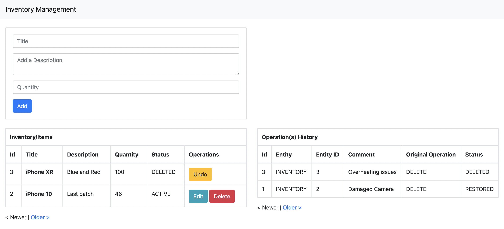
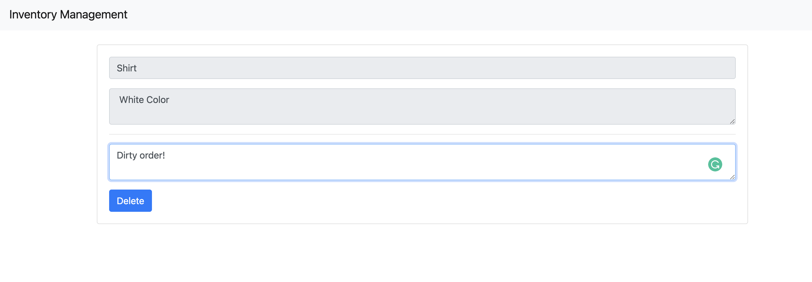

# Inventory Management - Shopify Fall 2022

CRUD Operations of inventory with deletion comments and undeletion.
Replit Link: [https://replit.com/@addu390/shopify-inventory-management](https://replit.com/@addu390/shopify-inventory-management)



### Requirements
- Basic CRUD Functionality.
- When deleting, allow deletion comments and undeletion.

### Replit Set-up
- The `.replit` file pre-configured to `RUN` on Replit
- Or run the below commands in the same order in Replit shell.
```
pip install -r requirements.txt
export FLASK_APP=setup.py
flask db init
flask db migrate -m "Migrate Tables"
flask db upgrade
flask run --host=0.0.0.0 --port=80
```
Set `export FLASK_DEBUG=1` for auto-reload.

### Usage
- `Add` action button to add an item to the inventory with details such as Title, Description, and Quantity.
- After adding, `Edit` or `Delete` the item, where `Edit` is a simple update operation on allowed fields.
- `delete` in this context is a soft delete. Ensure to add a comment mentioning the reason for deletion. 
- After deleting, `undo` the deletion if necessary while keeping track of the delete/restore history; the deletion history record will now be updated to `RESTORED`



**Note:**
- The history is not limited to the inventory table or delete operation and is extendable for other operations and entities.
- The Inventory and History tables are always consistent, with "all-or-nothing" atomic transactions.
- At any given point, there can only be one `DELETED` record of an item and 1-or-more record of `RESTORED`.
- While having individual backend and frontend applications is ideal, the Jinja templating engine is used for simplicity to render the UI.

### Low Coupling and High Cohesion:
- The storage layer is de-coupled; changing the datastore would require changes only in `storage.py`
- The resource/API layer `routes.py` only depends on the services classes (`InventoryService` and `HistoryService`) and not the storage layer.
